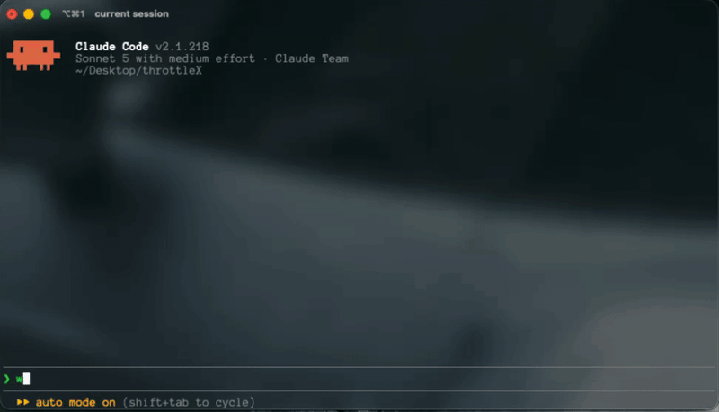

# ContextOS

[](https://www.npmjs.com/package/@siddharthakatiyar/contextos)
[](https://opensource.org/licenses/MIT)
AI coding assistants waste thousands of tokens searching large codebases, often missing the files that actually matter.

ContextOS indexes your repository into a semantic graph so AI Agents retrieve only the relevant functions, classes, documentation, and dependencies—reducing token usage while improving accuracy.

Instead of sending entire files, ContextOS sends only the code the model actually needs.

## Why ContextOS?

Instead of relying on ripgrep and whole-file context, ContextOS understands your repository at the semantic level.

- ✓ **Function-level retrieval** (AST symbols + large template-literal consts)
- ✓ **Sub-chunked large symbols** — oversized functions keep a parent chunk plus additive line-ranged segments (comment-derived segment titles)
- ✓ **Refactor-for-retrieval** — large scorers/compilers split into named helpers so deep markers stay intact
- ✓ **Hybrid search** — FTS5 + symbol/filename boosts + RRF fusion (optional local embeddings)
- ✓ **Automatic dependency expansion** via the relationship graph
- ✓ **Precision-first compile** — top-K full bodies + path:line stubs under a token budget
- ✓ **Cheap expand path** — stubs carry line ranges; `ctx_read_file` supports ranged reads; `get_symbol` for one symbol
- ✓ **Cross-session memory**
- ✓ **Incremental indexing** with stable chunk IDs and line ranges
- ✓ **Local-first (SQLite + FTS5 + optional sqlite-vec)**
- ✓ **Confidence-gated embeddings** — emb kNN only when keyword confidence is low (or when explicitly enabled)
- ✓ **Works with any AI Agent via MCP**

## Quick Start

```bash
npm install -g @siddharthakatiyar/contextos

cd my-project

# Initializes the repository and adds the MCP server to your AI client's config
contextos init
```

> **Note:** You do **not** need to run `contextos serve` manually. 
> The `serve` command is designed to be called by MCP clients (like any AI Agent) in the background over `stdio`. If you run it manually in your terminal, it will appear to hang as it waits for JSON-RPC messages.

Open your preferred AI Agent and start asking questions! That's it.

After upgrading, restart your MCP client. The daemon automatically rebuilds the
index when the indexer format changes; use `contextos reindex` only when you
explicitly want to force a fresh rebuild.

## The Problem: Traditional vs. ContextOS

### ⚡️ The ContextOS Difference

| Without ContextOS (42K+ Tokens) | With ContextOS (293 Tokens) |
|:---:|:---:|
|  |  |
| *Spawns expensive Explore subagents, blindly greps files, massive context bloat.* | *Instant semantic retrieval, pinpoint accuracy, minimal context usage.* |

| Traditional (Grep + Read) | ContextOS |
|---|---|
| Line hits, then whole-file Reads | Semantic symbols in one call |
| ripgrep | FTS5 + RRF + graph + filename/symbol boosts |
| Stateless | Learns over time |
| Manual context | Automatic retrieval |
| Often 2+ tool calls | Typically one `get_context` call |

### 100-Query Retrieval Benchmark (Redis 7.x Codebase)

A 100-query benchmark (50 targeted function queries, 50 broad conceptual queries) on the Redis 7.x C codebase (799 files). "Accuracy" here is file-level recall among the retrieved candidates.

| Metric | ContextOS |
|--------|-----------|
| **Targeted file recall** (exact-function queries) | **98%** (49/50) |
| **Conceptual file recall** (broad queries) | **96%** (48/50) |
| **Overall file recall** | **97%** (97/100) |
| **Avg tokens / query** | **589** |
| **Total tokens** (100 queries) | **58,880** |


**Key Takeaways:**
- **Surgical Precision:** ContextOS achieves 97% file-level accuracy while using **up to 99% fewer tokens** than traditional multi-file keyword chunking.
- **Near-Flawless Targeted Retrieval:** ContextOS's AST-aware matcher reliably zeroes in on exact function implementations (98% hit rate).
- **Strong Conceptual Retrieval:** ContextOS successfully resolves broad queries (e.g. "How does Redis start up?") to core implementation files 96% of the time, avoiding noise from dependencies or test scripts.

### Real-World Repository Benchmark

A 25-query end-to-end benchmark measuring the ability of an AI agent to independently explore and answer complex architectural queries across 5 massive open-source repositories (5 queries each).

| Repository | Agent Resolution Accuracy | Avg Tokens / Query |
|------------|---------------------------|--------------------|
| **Next.js** | 100% (5/5) | ~132 |
| **React** | 100% (5/5) | ~470 |
| **Langchain**| 100% (5/5) | ~194 |
| **FastAPI** | 100% (5/5) | ~262 |
| **Supabase** | 100% (5/5) | ~333 |
| **Overall** | 100% (25/25) | **~278** |

**Key Takeaways:**
- **Reliable Resolution:** ContextOS consistently provided the necessary semantic context for the agent to correctly resolve all 25 complex architectural queries.
- **Deep Search Capability:** In highly complex repositories like Supabase that force the agent into long multi-turn explorations, ContextOS maintains perfect resolution accuracy while severely undercutting traditional token consumption (averaging just 278 tokens across all repos).

## Real Retrieval Example

**User asks:**
> "How does authentication work?"

**Retrieved Context:**
- ✓ `login()` function (from `src/auth.ts`) — full body
- ✓ Related symbols as one-line stubs (path + signature) when budget is tight
- ✓ Graph-linked helpers / types when relevant

**Total tokens:** typically under the default **1,200** budget *(instead of multi-file Reads totaling thousands)*

## Architecture

```text
          Repository
        (src/, docs/, config/)
                  │
                  ▼
         Tree-sitter Parsers
          Markdown Parsers
                  │
                  ▼
         Semantic Graph Engine
           (SQLite + FTS5 + porter)
           + line ranges / file_stem
           + optional MiniLM embeddings
                  │
                  ▼
 ┌─────────────────────────────────┐
 │ Intent + keyword / stem / symbol│
 │ RRF fusion (+ optional emb kNN) │
 │ Graph expansion                 │
 │ Scoring + containment dedup     │
 │ Query-aware tiered compile      │
 │ Cross-session memory            │
 └─────────────────────────────────┘
                  │
                  ▼
         MCP Server (Stdio)
                  │
                   ▼
        AI Agent (via MCP)
```

## Features

### Indexing

**AST-aware chunks**  
Tree-sitter extracts functions, classes, and methods. Nested methods record `parent_symbol` so class vs method duplication can be deduped at retrieval time. Large top-level template-literal / string constants (e.g. SQL DDL) are indexed as searchable variables. Trivial anonymous lambdas are skipped. Chunks store stable IDs, `start_line` / `end_line`, and `file_stem` for ranking.

**Compact class outlines**  
When a class has methods, the class chunk stores a short member list instead of repeating every method body.

**Local embeddings (index-time)**  
On upsert, chunks are embedded with a local MiniLM model (`@huggingface/transformers`) into `sqlite-vec` when available. Indexing is on by default; **retrieval fusion is off by default** (keyword/RRF path is the accuracy baseline). Opt in with `embeddingsRetrieval: true` or `CONTEXTOS_EMBEDDINGS_RETRIEVAL=1`.

### Retrieval

**Multi-strategy matching + RRF**  
FTS5 (porter tokenizer, operator-preserving sanitizer), exact/prefix symbol lookup, filename and path-stem boosts, and intent-aware queries are fused with Reciprocal Rank Fusion. Foreign workspace chunks are down-ranked so other projects in a shared DB do not dominate.

**Graph expansion**  
Seeds from identifiers and top hits expand through the relationship graph (depth/node caps are configurable), including import edges.

**Containment dedup**  
If both a class outline and its methods survive ranking, oversized class bodies yield to methods; scores are merged.

### Context assembly (compile)

**Tiered, precision-first output**  
- Top-K chunks (adaptive, usually up to 3) render as **full bodies**
- Remaining hits become **stubs with path + line ranges** (`symbol — path/file.ts:12-84`) so agents can `ctx_read_file` or `get_symbol` instead of whole-file Reads
- Query-aware truncation preserves high-signal lines, comments/JSDoc, and branch headers
- Related entities capped; File Structure capped to one chunk
- Framing (headers / fences) counts toward the token budget (`gpt-tokenizer`)

**Diagnostic header**  
`get_context` prefixes a single line: `ContextOS | tokens: N/M`. When stubs remain, a one-line footer steers agents to `get_symbol` / ranged `ctx_read_file`.

### Memory

**Adaptive learning**  
Agents can rate chunks; feedback adjusts future scores (including implicit signals).

**Cross-session memory**  
Facts learned via `learn_fact` / knowledge tools persist across sessions and can appear in `get_context`.

**Backup & Recovery**  
ContextOS's SQLite database is fundamentally an ephemeral index. If corruption occurs, the daemon auto-detects it via `quick_check` and transparently self-heals by rebuilding the index. No manual backups are required unless you heavily rely on manual `knowledge_facts` which you can backup by simply copying `~/.contextos/index.db`.

### Developer Experience

**CLI**  
`init`, `reindex`, `serve`, `query`, `status`, `watch`, `visualize`, and more.
*Commands support graceful cancellation (Ctrl+C / SIGINT) to safely abort long-running indexing operations and rollback in-flight database transactions without causing lock-ups.*

**Concurrency**  
Repository indexing now runs with bounded concurrency to overlap CPU-intensive parsing and disk I/O, dramatically speeding up `init` and `reindex` on large codebases.

**MCP tools**  
The default stable tools are `get_context`, `reindex_context`, `contextos_status`, `ctx_execute`, `ctx_read_file`, `ctx_expand`, `ctx_topics`, `ctx_remember`, `learn_fact`, `forget_fact`, `rate_chunk`, `ctx_symbol`, `get_neighbors`, and `get_symbol`. Deprecated compatibility tools such as `save_context`, `ctx_list_topics`, and `ctx_read_topic` are available only when `legacyTools` is enabled.

**Zero-config setup**  
`contextos init` indexes the repo, writes MCP config if missing (does not overwrite an existing `contextos` MCP entry), and can start the background daemon.

## Configuration

Defaults live in `src/config/defaults.ts` and can be overridden via:

- `~/.contextos/config.json` (global)
- `.contextos/config.json` (repo)
- Env: `CONTEXTOS_EMBEDDINGS=0` disables embedding; `CONTEXTOS_EMBEDDINGS_RETRIEVAL=1` enables emb fusion at query time

Array keys in config use a `!` **suffix** to override (replace rather than merge) where documented — e.g. `"ignorePatterns!": ["only/**"]`.

| Key | Default | Notes |
|-----|---------|--------|
| `maxTokenBudget` | `1200` | Default compile budget; `get_context` `max_tokens` still accepts up to `8000` |
| `maxRetrievalResults` | `25` | Cap on scored chunks before compile |
| `ftsLimit` | `15` | Per-query FTS hit limit |
| `maxChunkTokens` | `1500` | Soft cap when creating chunks |
| `maxSymbolChunkTokens` | `900` | Function/method bodies above this also emit additive segment chunks |
| `layerBoosts` | session 1.5 / repo 1.3 / workspace 1.1 / global 1.0 | Multiplicative score boosts |
| `graphExpansionDepth` | `2` | Relationship walk depth |
| `graphExpansionMaxNodes` | `20` | Cap on expanded entities |
| `diversityDecay` | `0.7` | Penalty for many chunks from one file |
| `diversityPenaltyStart` | `3` | Start applying diversity decay after N chunks/file |
| `embeddingsEnabled` | `true` | Index-time local embeddings (`CONTEXTOS_EMBEDDINGS=0` to disable) |

### Pipeline Configurations

The optional `pipeline` object in config enables toggling specific query-time pipelines on or off:

| Key | Default | Notes |
|-----|---------|--------|
| `pipeline.graphExpansion` | `true` | Enable/disable relationship walking. |
| `pipeline.embeddingFusion` | *(unset)* | Fuse embedding kNN into retrieval. When unset it follows `embeddingsRetrieval` (off by default; confidence-gated fallback). Set `true`/`false` to force. |
| `pipeline.containmentDedup` | `true` | Enable/disable deduplication between classes and their member methods. |
| `pipeline.diversityFilter` | `true` | Enable/disable score decay for many chunks originating from the same file. |

### `get_context` parameters

| Param | Default | Description |
|-------|---------|-------------|
| `prompt` | required | Task or question |
| `max_tokens` | `maxTokenBudget` (1200) | Compile budget; max 8000 |
| `layers` | `session`, `workspace`, `repo` | Add `global` only when you need shared/third-party context |
| `output_format` | `markdown` | Or `xml` |

## CLI cheatsheet

```bash
contextos init                 # Index + MCP config (preserves existing contextos MCP entry)
contextos reindex              # Wipe local DB and re-init (needed after upgrades)
contextos reindex --embeddings # Backfill vectors without wiping the DB
contextos serve                # MCP stdio server (Run automatically by your AI client. Do not run manually.)
contextos query "..."          # Test retrieval locally
contextos status               # Index stats
contextos watch                # Live re-index on file changes
```

## Supported Languages

ContextOS leverages Tree-sitter for robust parsing. Supported out of the box:
- ✓ TypeScript / JavaScript (incl. TSX/JSX)
- ✓ Go
- ✓ Python
- ✓ Java
- ✓ C / C++
- ✓ Rust
- ✓ Markdown
- ✓ Common config formats (JSON, YAML, TOML, …)

## Quantifiable Benefits

- **Token Efficiency:** ~589 tokens/query (58.8k across 100 queries); a one-time comparison measured up to 99% fewer tokens than a multi-file extraction proxy.
- **98% Precision on Exact Functions:** The AST-aware matcher reliably finds implementation bodies instead of grepping test files.
- **Robust Conceptual Retrieval:** Resolves broad queries accurately 96% of the time.
- **Low latency:** Local SQLite FTS5 retrieval typically completes in milliseconds.
- **Cost savings:** Smaller prompts for API-backed agents mean significantly lower spend per query, and fewer API round-trips.

## Author

**Siddhartha Katiyar**

- Twitter/X: [@siddharthakat25](https://x.com/siddharthakat25)
- LinkedIn: [Siddhartha Katiyar](https://www.linkedin.com/in/siddharthakatiyar/)

## License

MIT — see [LICENSE](LICENSE).
